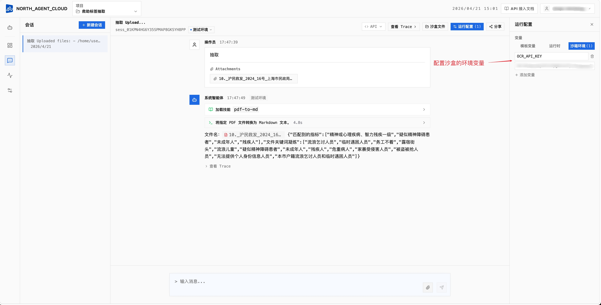

# 开始之前：样例项目的通用约定

> 这份文档是 9 个样例**共用**的基础知识。读完这里再去看任何一篇 TUTORIAL，都会轻松很多。

## 目录

- [你将得到什么](#你将得到什么)
- [样例项目的通用目录结构](#样例项目的通用目录结构)
- [三个关键文件](#三个关键文件)
- [如何把样例跑起来](#如何把样例跑起来)
- [环境变量配置](#环境变量配置)
- [常见问题](#常见问题)

---

## 你将得到什么

每个样例解压/进入后，都是一个可以**直接上传到 North Agent Cloud（NAC）** 的完整 Agent 项目：

- **源码目录**（如 `企业数据库问数/enterprise_data_agent/`）：可直接打包上传
- **打包文件**（如 `劳动法问答/劳动法层级化 QA.tar`）：已经打好包

---

## 样例项目的通用目录结构

9 个样例结构几乎一致，先眼熟这个模板：

```
<sample-root>/
├── nexau.json                ← 项目清单：声明 Agent 入口、发布时排除的文件
├── <agent>/
│   ├── agent.yaml            ← 骨架：模型配置、工具注册、中间件
│   ├── systemprompt.md       ← 大脑：角色定位 + 工作流 + 输出规范
│   ├── tools/                ← 手脚：内置工具 / 自定义工具声明（.tool.yaml）
│   ├── custom_tools/         ← 自定义工具的 Python 实现（按需）
│   ├── mcp_server/           ← 内嵌 MCP server 实现（按需；生产更推荐外部 HTTP MCP 服务）
│   └── skills/               ← 领域知识：层级化 SKILL.md 及原文
│       └── <skill-name>/
│           ├── SKILL.md      ← 技能索引
│           └── references/   ← 政策/法规原文
```

---

## 三个关键文件

记住这三个，你就看得懂任何一个样例：

| 文件 | 回答的问题 | 打开先看什么 |
|------|-----------|------------|
| **`nexau.json`** | 这个项目里有**哪些 Agent**？ | `agents` 字段 |
| **`agent.yaml`** | 这个 Agent **长什么样**？ | 模型、`tools`、`skills`、`middleware` |
| **`skills/**/SKILL.md`** | 这个 Agent **知道什么**？ | frontmatter `description`、子目录索引 |

---

## 如何把样例跑起来

整体流程：**打包 → 浏览器登录 NAC → 新建项目 → 上传 artifact → 部署 → 在 Playground 对话**。

### 1. 准备 artifact

对于**源码目录**，把整个样例根目录（含 `nexau.json` 的那一层）压缩成 `.zip`：

```bash
cd tutorial_public/企业数据库问数
zip -r enterprise_data_agent.zip . -x "*.DS_Store" "*__pycache__*" "*.env"
```

> `nexau.json` 里的 `excluded` 字段会在平台侧再做一次过滤，敏感文件不会被发布。

对于**已经打包好的**样例（`.tar`/`.zip`），直接用即可。

### 2. 浏览器登录 North Agent Cloud

打开 NAC 网页控制台，使用账号登录。

### 3. 新建项目并上传

- **新建项目**：填写项目名称与描述
- **上传 artifact**：把上一步的 `.zip` 拖到上传区
- **部署**：选择一个环境（如 `dev`）点击部署

### 4. 在 Playground 对话

部署成功后，控制台右侧会出现对应环境的 Playground——直接输入问题即可测试。

> 之后修改代码 → 重新打包 → 通过网页重新上传新版本 → 部署。

---

## 环境变量配置

部分样例需要外部服务密钥（如 OCR、Finnhub）。这类 Key 以**沙盒环境变量**的形式注入到 Agent 运行时的沙箱容器，Agent 代码中用 `os.getenv("XXX")` 读取。

| 变量 | 来源 | 哪些样例需要 |
|------|------|-------------|
| `OCR_API_KEY` | OCR 服务商 | 住房公积金审核、公文写作（涉及 PDF） |
| `X_FINNHUB_SECRET` | [finnhub.io](https://finnhub.io) | 金融数据智能体 |
| `MAP_APP_KEY` / `MAP_APP_SECRET` / `MAP_USER_ID` | MAP 平台 | MAP 知识库问答 |
| `DAMENG_DB_CONN_STR` | 自己的达梦数据库 | 达梦数据库（**Runtime Var**，不是 Sandbox Var） |
| `LLM_MODEL` / `LLM_BASE_URL` / `LLM_API_KEY` | OpenAI 兼容 LLM 网关 | 达梦数据库（自定义 LLM 不走平台默认） |
| 其他 API Key | 视场景而定 | — |

配置沙盒环境变量有**两种方式**：

### 方式 1：Playground 控制台（适合调试）

打开会话右上角的 **运行配置** 面板 → 切到 **沙箱环境** 标签页 → 点 **+ 添加变量**，填入 Key/Value 后保存。下一条消息生效。



### 方式 2：Chat API 调用（适合程序化集成）

调用 `/agent-api/chat` 时，通过 `variables.sandbox_env` 字段传入，**只对本次请求生效**：

```bash
curl -kN -sS -X POST "https://nac.xiaobei.top/agent-api/chat" \
  -H "Authorization: Basic $(echo -n '<AK>:<SK>' | base64)" \
  -H "Content-Type: application/json" \
  -H "Accept: text/event-stream" \
  -d '{
    "version_tag": "v1.0.0",
    "distinct_id": "user-123",
    "session_id": "<session_id>",
    "messages": [{"role": "user", "content": "Hello"}],
    "stream": true,
    "source": "playground",
    "variables": {
      "template": {"project_name": "my-app"},
      "runtime_vars": {"api_key": "sk-xxx"},
      "sandbox_env": {"OCR_API_KEY": "sk-ocr-xxx", "X_FINNHUB_SECRET": "xxx"}
    }
  }'
```

`variables` 三种用法区别：`template` 用于 Prompt 模板占位符，`runtime_vars` 用于运行时变量传递，`sandbox_env` 才是注入到沙箱进程的**环境变量**（等同于 Playground 里「沙箱环境」那一栏）。

### 本地调试

本地开发可以把密钥写到 `.env`，并在 `nexau.json` 的 `excluded` 里声明排除以防泄露：

```json
{
  "agents": { "...": "..." },
  "excluded": [".nexau/", ".env", "__pycache__/"]
}
```

---

## 常见问题

### Q: Skill 路径运行时报 not found？
在 `agent.yaml` 中声明的 `./skills/xxx`，运行时会部署到 **`.skills/xxx`**（带点号）。system prompt 和 SKILL.md 中引用其他知识文件时统一用 `.skills/` 前缀。

### Q: 中间件 import 路径？
`nexau.archs.main_sub.execution.middleware.xxx`，注意有 `execution` 这一层。常用：

- `context_compaction:ContextCompactionMiddleware` — 长对话自动压缩上下文
- `long_tool_output:LongToolOutputMiddleware` — 超长工具输出切分
- `sensitive_word:SensitiveWordMiddleware` — 敏感词内容安全拦截（RFC-0027，暂未合入 NexAU main，见样例 ⑨）

### Q: 上传后部署报错找不到 Agent？
检查 `nexau.json` 里 `agents` 字段指向的 `agent.yaml` 路径是否正确。路径是**相对于 `nexau.json`** 的。

### Q: `.env` 不小心被上传了？
在 `nexau.json` 的 `excluded` 里加入 `.env`，重新打包上传。NAC 侧也会过滤常见敏感文件，但建议你主动声明。

### Q: Agent 回答时没调用 Skill？
检查 `SKILL.md` 的 frontmatter `description`——它是 Agent 决定「要不要用这个技能」的依据。写清楚触发条件（什么时候该用这个 Skill）。

### Q: MCP server 连接失败？
先确认 MCP server 是独立服务,本地用 `curl` 试一下 `http://<mcp-url>` 是否返回 200/405。例如数据库 MCP 样例:

```bash
curl -sI -m 5 http://127.0.0.1:8000/mcp
# 期望:HTTP/1.1 405 (HEAD 不允许,但 server 活着) 或 200
```

如果本地能过、平台连接失败，优先检查 `agent.yaml` 里的 `mcp_servers.url` 是否能从 NAC 沙箱访问，以及 `Host`、`Accept`、鉴权 headers 是否配置正确。使用 `host.docker.internal` 访问宿主机服务时，通常需要显式设置 `Host: localhost:8000`，否则 MCP server 可能返回 `421 Invalid Host header`。

---

准备就绪后，回到 [README](./README.md) 挑一个样例开始。推荐从 **劳动法问答**（Level 1）起步。
